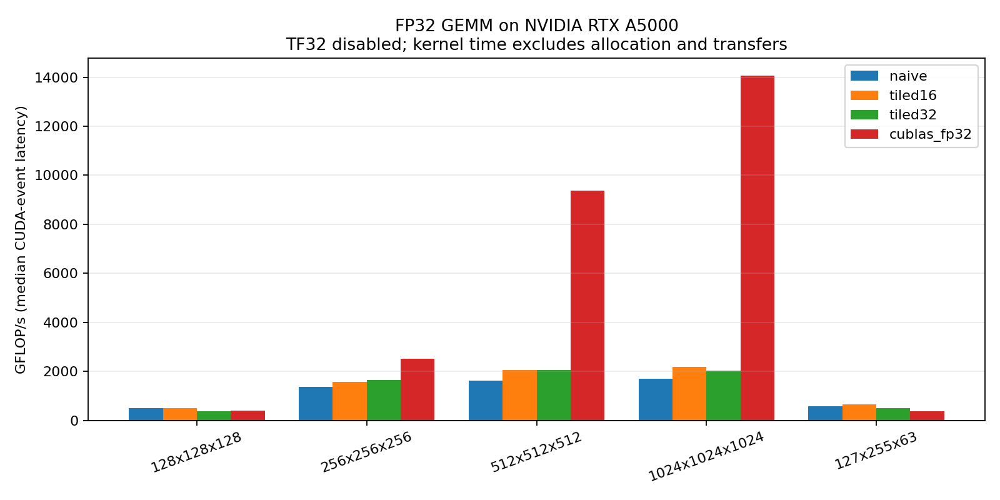

# CUDA GEMM optimization ladder

<!-- BEGIN GENERATED PROJECT GUIDE -->

## Purpose and first steps

Compare correctness and measured FP32 throughput across naive, tiled, and cuBLAS GEMM.

**Who it is for:** Learners and GPU engineers comparing matrix-multiplication implementations.

**First task:** Read the recorded comparison, then run the checked GEMM executable on your own selected GPU.

**What to expect:** Correctness checks plus latency/throughput comparisons for naive GEMM, shared-memory tiles, and strict FP32 cuBLAS.

**Current scope:** Implemented CUDA comparison with recorded RTX A5000 measurements. Speedups depend on shape and hardware; later optimizations remain future work.

**Start here:** [Benchmark method and limitations](BENCHMARKS.md).

**Related projects:** [kernel-forge](https://github.com/zesun33/kernel-forge), [cuda-memory-benchmark](https://github.com/zesun33/cuda-memory-benchmark).

[Choose another project](https://github.com/zesun33/personal-projects/blob/main/GETTING_STARTED.md).
<!-- END GENERATED PROJECT GUIDE -->

A reproducible row-major FP32 comparison: naive GEMM, 16×16 and 32×32 shared-memory tiles, and cuBLAS SGEMM with TF32/Tensor Core math disabled.

```bash
make build/02_gemm_comparison ARCH=sm_86  # choose your GPU architecture
CUDA_VISIBLE_DEVICES=0 ./scripts/verify.sh
python3 -m pip install -r requirements-plots.txt
CUDA_VISIBLE_DEVICES=0 python3 scripts/benchmark.py --out results/my-run
```

The executable uses visible device 0. Set `CUDA_VISIBLE_DEVICES` to choose a host GPU; on the recorded cluster run it was `4`. `CUDA_ARCH` controls the verification build; the default is `sm_86`. Do not run benchmarks on another user's busy GPU.

## Recorded measurements — RTX A5000, 2026-10-03



At 1024³, median kernel throughput was **1.694 TFLOP/s naive**, **2.194 TFLOP/s tiled16 (1.29×)**, **2.044 TFLOP/s tiled32 (1.21×)**, and **14.075 TFLOP/s strict FP32 cuBLAS (8.31×)**. Small and rectangular cases can be slower with tiling or cuBLAS; inspect all rows rather than assuming every implementation is faster.

- [Raw timing samples and provenance](results/2026-10-03-rtx-a5000/results.json)
- [Latency, throughput, errors, and speedups](results/2026-10-03-rtx-a5000/summary.csv)
- [Method and limitations](BENCHMARKS.md)

The existing `01_naive_gemm` remains a standalone learning baseline. Its illustrative output below is not the source of the recorded comparison above.

# Quick Start Guide

## Compilation

If you have a CUDA-capable GPU, you can compile and run the naive GEMM kernel:

### Option 1: Using Make (Recommended)

```bash
# Build all kernels
make

# Run naive GEMM with default size (1024×1024×1024)
make run_naive

# Clean build artifacts
make clean
```

**Note**: If you don't have an A100 (sm_80), change the architecture:
```bash
# For RTX 3090/3080 (sm_86)
make ARCH=sm_86

# For RTX 4090 (sm_89)
make ARCH=sm_89

# For V100 (sm_70)
make ARCH=sm_70
```

### Option 2: Manual Compilation

```bash
# Compile
nvcc -O3 -arch=sm_80 src/01_naive_gemm.cu -o build/naive_gemm

# Run
./build/naive_gemm 1024 1024 1024
```

## Usage

```bash
./build/01_naive_gemm [M] [N] [K]

# Examples:
./build/01_naive_gemm 512 512 512      # Small matrix
./build/01_naive_gemm 1024 1024 1024   # Medium matrix
./build/01_naive_gemm 2048 2048 2048   # Large matrix
```

## Illustrative standalone-baseline output

```
=============================================================
Naive GEMM Benchmark
=============================================================
Matrix dimensions: C(1024 × 1024) = A(1024 × 1024) × B(1024 × 1024)
Total FLOPs: 2.15e+09

Initializing matrices...
Running GPU kernel...
  Grid: (64, 64), Block: (16, 16)
  Total threads: 262144

Running CPU reference...
Verifying result...
Max error: 1.192093e-07
Errors (>1e-03): 0 / 1048576 (0.00%)
✓ Verification PASSED!

=============================================================
Benchmarking...
=============================================================
Average time: 8.234 ms
Performance:  261.25 GFLOPS (0.2613 TFLOPS)
Efficiency:   1.34% of A100 FP32 peak (19.5 TFLOPS)
Bandwidth:    1458.32 GB/s
=============================================================
```

## What to Look For

1. **Verification**: Should say "✓ Verification PASSED!"
2. **Performance**: Compare recorded samples for the same GPU, matrix shape, and measurement method.
3. **Efficiency**: Treat peak-throughput ratios as a model-dependent comparison; they do not identify a bottleneck by themselves.

## Next Steps

After inspecting the checked comparison, further study can:
- Profile with Nsight Compute to identify bottlenecks
- Extend the existing shared-memory cases with register tiling
- Measure speedups or slowdowns against the same checked baselines

---

## Troubleshooting

**No CUDA GPU available?**
- The code will still compile but won't run
- You can study the code and understand the concepts
- Consider using Google Colab or cloud GPU instances

**Compilation errors?**
- Check your CUDA toolkit version: `nvcc --version`
- Make sure your GPU architecture is correct
- Try a different `-arch` flag

**Performance much lower than expected?**
- This is intentional! The naive version is the baseline
- We'll optimize in subsequent lessons
