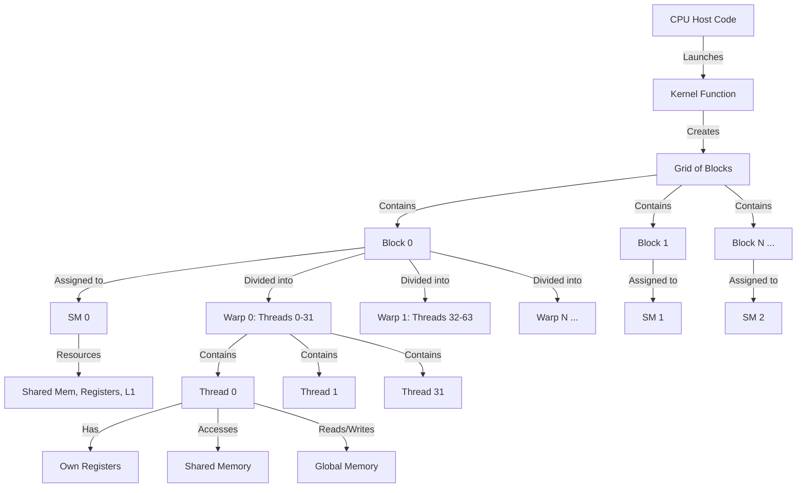

# 01. GEMM Fundamentals & GPU Architecture

## What is GEMM?

**GEMM** stands for **General Matrix Multiply**. It is the most fundamental operation in linear algebra and the computational backbone of modern deep learning.

### Mathematical Definition

```
C = α · (A × B) + β · C
```

Where:
- `A` is an `M × K` matrix
- `B` is a `K × N` matrix
- `C` is an `M × N` matrix (both input and output)
- `α` and `β` are scalar coefficients

**Simplified Form** (what we'll implement first):
```
C = A × B
```

### Why GEMM Matters

**In Deep Learning**, nearly every operation reduces to GEMM:

| Operation | GEMM Mapping |
|-----------|-------------|
| **Fully Connected Layer** | `Y = X · W` (batch × features) |
| **Convolution** | `im2col(X) · W` (unroll spatial dims) |
| **Attention (QKV)** | `Q·K^T`, then `Attention·V` |
| **Gradient Backprop** | `dL/dW = X^T · dL/dY` |

**Industry Impact**: 
- **90%+ of training FLOPs** in Transformers (GPT, BERT) are GEMM.
- A **10% speedup in GEMM** = **10% faster LLM training** ≈ **$millions saved** at scale.

---

## The Physics: Roofline Model

The **Roofline Model** tells us the *theoretical limit* of our kernel's performance.

### Step 1: Define Arithmetic Intensity

**Arithmetic Intensity (AI)** measures how compute-heavy an operation is relative to memory:

```
AI = FLOPs / Bytes Transferred
```

#### For GEMM (`C = A × B`):

**FLOPs**:
```
Total FLOPs = 2 · M · N · K
```
- Each output element `C[i,j]` requires `K` multiply-adds.
- Total elements in `C` = `M × N`.
- Each multiply-add = 2 FLOPs (1 multiply + 1 add).

**Bytes Transferred** (Naive Case - No Reuse):
```
Bytes = (M·K + K·N + M·N) · sizeof(float)
      = (M·K + K·N + M·N) · 4 bytes
```

**Arithmetic Intensity**:
```
AI = (2·M·N·K) / (4·(M·K + K·N + M·N))
   = (2·M·N·K) / (4·(M·K + K·N + M·N))
```

**For Square Matrices** (M = N = K):
```
AI = (2·N³) / (4·3·N²) = N/6 FLOPs/Byte
```

**Key Insight**: As `N` increases, AI increases linearly. Larger matrices are more compute-bound.

### Step 2: GPU Hardware Limits (Example: NVIDIA A100)

| Resource | Peak Performance |
|----------|------------------|
| **DRAM Bandwidth** | 1,555 GB/s |
| **FP32 Compute** | 19.5 TFLOPS |
| **FP16 Tensor Core** | 312 TFLOPS |

**The "Roof"**:
```
Attainable TFLOPS = min(Peak Compute, Bandwidth × AI)
```

#### Example: N=1024 (1K × 1K GEMM)

```
AI = 1024 / 6 ≈ 170 FLOPs/Byte

Memory-Bound Limit = 1555 GB/s × 170 = 264 TFLOPS (exceeds peak!)
Compute-Bound Limit = 19.5 TFLOPS

→ We are COMPUTE BOUND (good!)
```

#### Example: N=128 (Small Matrix)

```
AI = 128 / 6 ≈ 21 FLOPs/Byte

Memory-Bound Limit = 1555 GB/s × 21 = 32 TFLOPS
Compute-Bound Limit = 19.5 TFLOPS

→ We are COMPUTE BOUND (still good for FP32)
```

**Takeaway**: For N ≥ 128, we need to focus on **maximizing instruction throughput** (occupancy, ILP) rather than just bandwidth.

### Deep Dive: Why the Bottleneck Shifts

When optimizing GPU code, you're always limited by one of two resources:

#### 1. **Memory-Bound** (Bandwidth Limited)
- **Problem**: The compute units are idle, waiting for data from DRAM.
- **Symptom**: Your GPU can do the math faster than it can fetch the operands.
- **Fix**: Reduce memory traffic (tiling, data reuse, compression).

#### 2. **Compute-Bound** (Instruction Throughput Limited)
- **Problem**: You have all the data you need, but not enough threads/instructions executing to keep the ALUs busy.
- **Symptom**: DRAM bandwidth is underutilized; the compute units are the bottleneck.
- **Fix**: Increase parallelism (more threads, more work per thread).

#### Why N ≥ 128 is Compute-Bound

From our calculation above:
```
N = 128:  Memory can feed 32 TFLOPS, but ALUs only do 19.5 TFLOPS
N = 1024: Memory can feed 264 TFLOPS, but ALUs only do 19.5 TFLOPS
```

**Translation**: Even with *perfect* memory efficiency, we're capped at 19.5 TFLOPS because **the ALUs can't execute instructions fast enough**.

#### What This Means for Optimization

When compute-bound, reducing DRAM traffic won't help much. Instead, focus on:

**A. Occupancy (More Threads Active)**

**Occupancy** = (Active Warps per SM) / (Max Warps per SM)

The GPU has many compute units, but they need **warps** to execute. If you don't have enough warps scheduled:
- **Low occupancy** → ALUs sit idle → Low throughput
- **High occupancy** → More warps hide latency → Better throughput

**How to increase**:
- Use more threads per block
- Reduce register usage per thread
- Reduce shared memory per block

**B. ILP (Instruction-Level Parallelism) (More Work per Thread)**

**ILP** = Number of independent instructions a thread can execute concurrently.

Modern GPUs can execute multiple instructions per thread *simultaneously* if they don't depend on each other:

```cpp
// Low ILP - each instruction depends on the previous
float a = x[i];
float b = a * 2.0f;      // Waits for a
float c = b + 3.0f;      // Waits for b

// High ILP - instructions are independent
float a = x[i];
float b = y[i];          // Can execute in parallel with line above
float c = z[i];          // Can execute in parallel with both
float result = a + b + c; // Waits for all, then executes
```

**Why this matters**:
- **High ILP** → Compiler schedules many ops per cycle → ALUs stay busy
- **Low ILP** → Waiting for dependencies → ALUs stall

**How to increase**:
- Each thread computes multiple output elements (register blocking)
- Use vectorized loads/stores (`float4`)
- Unroll loops

#### Concrete Example: Naive GEMM (N=1024)

Suppose each thread computes one element of C:

```cpp
// Thread (i, j) computes C[i][j]
float sum = 0.0f;
for (int k = 0; k < 1024; k++) {
    sum += A[i][k] * B[k][j];  // Low ILP: depends on previous iteration
}
C[i][j] = sum;
```

**What happens?**
1. **Bandwidth is fine** (AI = 170, we're not memory-bound)
2. **But**: Each thread only has 1 independent accumulator (`sum`)
   - The loop has a **dependency chain**: iteration `k+1` needs the result of iteration `k`
   - **ILP ≈ 1** → ALUs are underutilized
   - **Observed performance**: ~1-2 TFLOPS (5-10% of peak)

**The fix** (later lessons):
- Each thread computes an **8×8 tile** of C (64 elements)
- 64 independent accumulators → **ILP ≈ 64**
- GPU can schedule many ops in parallel → **10-15 TFLOPS** (50-75% of peak)

#### Summary Table

| Regime | Bottleneck | Focus |
|--------|-----------|-------|
| **Memory-Bound** (Small N) | DRAM Bandwidth | Reduce traffic (tiling, caching) |
| **Compute-Bound** (Large N) | Instruction Throughput | Increase parallelism (occupancy, ILP) |

**For N ≥ 128 with FP32**: We're compute-bound, so:
- ✅ **Do**: Increase threads, unroll loops, use register blocking
- ❌ **Don't**: Obsess over every byte of DRAM traffic (it's not the bottleneck)

---

## GPU Memory Hierarchy

### What is an SM?

Before we dive into the memory hierarchy, you need to understand the **SM (Streaming Multiprocessor)**.

An **SM** is the fundamental building block of NVIDIA GPU architecture. It's a cluster of compute resources that includes:
- **CUDA Cores** (ALUs for FP32/FP64 arithmetic)
- **Tensor Cores** (for specialized matrix operations, if available)
- **Register File** (fast storage for thread-local variables)
- **Shared Memory** (programmable cache shared by all threads in a block)
- **L1 Cache** (automatic cache, often unified with Shared Memory)
- **Warp Schedulers** (issue instructions to warps of 32 threads)

#### Analogy: SM as a "Mini-GPU"

Think of an SM as a **self-contained compute unit**. A full GPU chip contains many SMs:
- **NVIDIA A100**: 108 SMs
- **RTX 4090**: 128 SMs
- **H100**: 132 SMs

Each SM can execute **multiple warps concurrently** (typically 32-64 active warps per SM).

#### Why "Per SM" Matters

When you see **"Shared Memory per SM"** or **"Registers per SM"**, it means:
- Each SM has its **own independent pool** of that resource
- **Thread blocks are assigned to SMs** at launch
- All threads within a block **share** that SM's resources
- Different blocks on different SMs **cannot** share data via Shared Memory

**Example**:
- A100 has **164 KB of Shared Memory per SM**
- Total across all 108 SMs = 164 KB × 108 ≈ 17.3 MB
- But a **single thread block** can only use up to 164 KB (because it runs on one SM)

**Implication for occupancy**: If your kernel uses 100 KB of Shared Memory per block, you can only fit **1 block per SM** (164 KB / 100 KB = 1.64). This limits parallelism.

#### CUDA Cores: The Physical Compute Units

**CUDA cores** are the actual hardware execution units (ALUs - Arithmetic Logic Units) inside each SM that perform arithmetic operations.

**Key Relationship**:
```
SM (Streaming Multiprocessor)
 ├─ Contains 64-128 CUDA Cores (depends on GPU architecture)
 ├─ Contains Tensor Cores (if available)
 ├─ Contains Register File
 ├─ Contains Shared Memory
 └─ Contains Warp Schedulers
      └─ Issue instructions to CUDA Cores
```

**Important**: Threads **DO NOT** have a 1:1 mapping to CUDA cores. Instead:

1. **A warp (32 threads)** executes one instruction on **32 CUDA cores simultaneously**
2. **SMs have more warps resident than can execute at once** (timeslicing)
3. **The warp scheduler** picks which warp executes on the CUDA cores each cycle

**Example (NVIDIA A100)**:
- **64 FP32 CUDA cores per SM**
- Can execute **2 warps simultaneously** (2 × 32 = 64 threads)
- But each SM can have **64 active warps** resident (2048 threads total)
- The scheduler rapidly switches between warps to hide memory latency

**Visualization**:
```
        SM (Streaming Multiprocessor)
        ┌─────────────────────────────────┐
        │  Warp Scheduler                 │
        │  (picks which warp executes)    │
        └──────────┬──────────────────────┘
                   │ Issues instruction
                   ↓
        ┌─────────────────────────────────┐
        │  CUDA Cores (Physical ALUs)     │
        │  [Core0][Core1]...[Core63]      │
        │   ↑      ↑           ↑           │
        │   │      │           │           │
        │  T0     T1   ...    T31          │ ← Warp 0 executing
        │                                  │
        └──────────────────────────────────┘

Multiple warps "time-share" the same CUDA cores:
- Cycle 1: Warp 0 executes (threads 0-31 use cores 0-31)
- Cycle 2: Warp 5 executes (threads 160-191 use cores 0-31)
- Cycle 3: Warp 2 executes (threads 64-95 use cores 0-31)
```

**Why Timeslicing? Latency Hiding!**

GPUs have **high latency** for operations (memory loads ~400-800 cycles):

1. **Warp 0** issues a memory load → goes to sleep (waiting for data)
2. **Warp 1** executes on the CUDA cores (while Warp 0 waits)
3. **Warp 2** executes
4. ... (cycle through many warps)
5. **Warp 0's data arrives** → it wakes up and executes

This is why **occupancy** (having many warps active) is critical - it keeps the CUDA cores busy while other warps wait for slow operations.

**Summary**: CUDA cores are the **workers**, warps are the **tasks**, and the warp scheduler is the **manager** assigning tasks to workers.

---

Understanding the memory hierarchy is critical for optimization.

```
┌─────────────────────────────────────────────────┐
│  Registers (per thread)                         │  Latency: ~1 cycle
│  - Fastest storage, limited (~64KB per SM)      │  Bandwidth: N/A
└─────────────────────────────────────────────────┘
            ↕
┌─────────────────────────────────────────────────┐
│  Shared Memory (per SM)                         │  Latency: ~20-30 cycles
│  - Programmable cache, fast (up to 164KB/SM)    │  Bandwidth: ~19 TB/s
│  - Explicitly managed by programmer             │
└─────────────────────────────────────────────────┘
            ↕
┌─────────────────────────────────────────────────┐
│  L2 Cache (shared across all SMs)               │  Latency: ~200 cycles
│  - Automatic, limited control (40-80 MB)        │  Bandwidth: ~5-10 TB/s
└─────────────────────────────────────────────────┘
            ↕
┌─────────────────────────────────────────────────┐
│  Global Memory (DRAM / HBM)                     │  Latency: ~400-800 cycles
│  - Massive capacity (16-80 GB)                  │  Bandwidth: 1-2 TB/s
│  - High latency, limited bandwidth              │
└─────────────────────────────────────────────────┘
```

### The Optimization Ladder

Each optimization moves data "up" this hierarchy:

| Optimization Stage | Data Movement |
|--------------------|---------------|
| **Naive GEMM** | Every element read from Global Memory |
| **Shared Memory Tiling** | Blocks of A, B loaded into Shared Mem |
| **Register Blocking** | Tile results accumulated in Registers |
| **Tensor Cores** | Matrix fragments stay in Register File |

**The Goal**: Maximize data reuse at higher levels to minimize expensive DRAM accesses.

---

## The Complete CUDA Hierarchy: Visual Overview

Before diving into details, let's see how **everything** fits together.

### What is a Kernel?

**A kernel** is a function that runs on the GPU. It's the "job description" executed by thousands of threads in parallel.

**Syntax**:
```cpp
__global__ void myKernel(float* data) {
    // This code runs on the GPU
    int idx = blockIdx.x * blockDim.x + threadIdx.x;
    data[idx] = data[idx] * 2.0f;
}

// CPU code launches the kernel
myKernel<<<numBlocks, threadsPerBlock>>>(data);
//         ^^^^^^^^^^  ^^^^^^^^^^^^^^^^
//         Grid size   Block size
```

**Key Points**:
- `__global__` = This function is a kernel (runs on GPU, called from CPU)
- **One kernel** → **Thousands/millions of threads** all executing the same code
- CPU launches the kernel and optionally waits for completion

### The Complete Hierarchy (Top to Bottom)

```
┌─────────────────────────────────────────────────────────────────┐
│                           CPU (Host)                            │
│  - Allocates memory (cudaMalloc)                                │
│  - Launches kernel: myKernel<<<grid, block>>>(args)             │
└─────────────────┬───────────────────────────────────────────────┘
                  │
                  │ Launch Kernel
                  ↓
┌─────────────────────────────────────────────────────────────────┐
│                      GPU (Device)                               │
│                                                                 │
│  ┌────────────────────────────────────────────────────────┐   │
│  │                  KERNEL (the function)                  │   │
│  │  __global__ void myKernel(...) { /* code */ }           │   │
│  │                                                          │   │
│  │  Executed by all threads across all blocks             │   │
│  └────────────────────────────────────────────────────────┘   │
│                          │                                      │
│                          │ Creates                              │
│                          ↓                                      │
│  ┌────────────────────────────────────────────────────────┐   │
│  │               GRID (all blocks)                         │   │
│  │  - Dimensions: gridDim.x, gridDim.y, gridDim.z          │   │
│  │  - Example: 1024 blocks                                 │   │
│  │                                                          │   │
│  │  ┌──────────┐  ┌──────────┐  ┌──────────┐             │   │
│  │  │ Block 0  │  │ Block 1  │  │ Block 2  │  ...        │   │
│  │  │ (on SM 0)│  │ (on SM 1)│  │ (on SM 0)│             │   │
│  │  └────┬─────┘  └────┬─────┘  └──────────┘             │   │
│  └───────┼─────────────┼─────────────────────────────────┘   │
│          │             │                                       │
│          │             │ Blocks assigned to SMs                │
│          ↓             ↓                                       │
│  ┌──────────────┐  ┌──────────────┐  ┌──────────────┐       │
│  │   SM 0       │  │   SM 1       │  │   SM 2       │  ...  │
│  │              │  │              │  │              │       │
│  │ Resources:   │  │ Resources:   │  │ Resources:   │       │
│  │ - CUDA Cores │  │ - CUDA Cores │  │ - CUDA Cores │       │
│  │ - Registers  │  │ - Registers  │  │ - Registers  │       │
│  │ - Shared Mem │  │ - Shared Mem │  │ - Shared Mem │       │
│  │ - L1 Cache   │  │ - L1 Cache   │  │ - L1 Cache   │       │
│  │              │  │              │  │              │       │
│  │ Runs:        │  │ Runs:        │  │ Runs:        │       │
│  │ - Block 0    │  │ - Block 1    │  │ - Block 3    │       │
│  │ - Block 2    │  │              │  │              │       │
│  └──────┬───────┘  └──────────────┘  └──────────────┘       │
│         │                                                     │
│         │ Block divided into Warps                           │
│         ↓                                                     │
│  ┌─────────────────────────────────────────────┐            │
│  │          BLOCK 0 (256 threads)               │            │
│  │  - blockIdx.x = 0                            │            │
│  │  - blockDim.x = 256                          │            │
│  │  - Shared Memory: __shared__ float tile[];   │            │
│  │                                               │            │
│  │  ┌────────────────────────────────────┐     │            │
│  │  │ Warp 0 (threads 0-31)              │     │            │
│  │  │ [T0][T1][T2]...[T30][T31]          │     │            │
│  │  │ All execute SAME instruction       │     │            │
│  │  └────────────────────────────────────┘     │            │
│  │  ┌────────────────────────────────────┐     │            │
│  │  │ Warp 1 (threads 32-63)             │     │            │
│  │  │ [T32][T33][T34]...[T62][T63]       │     │            │
│  │  └────────────────────────────────────┘     │            │
│  │  ┌────────────────────────────────────┐     │            │
│  │  │ Warp 2 (threads 64-95)             │     │            │
│  │  └────────────────────────────────────┘     │            │
│  │  ...                                         │            │
│  │  ┌────────────────────────────────────┐     │            │
│  │  │ Warp 7 (threads 224-255)           │     │            │
│  │  └────────────────────────────────────┘     │            │
│  └─────────────────────────────────────────────┘            │
│                                                               │
│  Each THREAD has:                                            │
│  - threadIdx.x (0-255 in this block)                         │
│  - Own registers                                             │
│  - Accesses shared memory: tile[threadIdx.x]                 │
│                                                               │
└───────────────────────────────────────────────────────────────┘
```

### Hierarchical Relationships (Mermaid Diagram)



### Key Relationships Summary

| Element | Contains | Assigned To | Resources |
|---------|----------|-------------|-----------|
| **CPU** | Launches kernel | - | System RAM |
| **Kernel** | Grid of blocks | GPU | - |
| **Grid** | All blocks | GPU | - |
| **Block** | Warps (groups of 32 threads) | One SM | Shared Memory |
| **SM** | Blocks (1+ at a time) | Physical hardware | CUDA Cores, Registers, Shared Mem, L1 |
| **Warp** | 32 consecutive threads | Warp scheduler on SM | - |
| **Thread** | Executes kernel code | One CUDA core (timesliced) | Own registers |

### Example: Launch Configuration

```cpp
// Launch 1024 blocks, each with 256 threads
myKernel<<<1024, 256>>>(data);

// What gets created:
// - Grid: 1024 blocks
// - Each Block: 256 threads = 8 warps (256 / 32 = 8)
// - Total Threads: 1024 * 256 = 262,144 threads
// - Total Warps: 1024 * 8 = 8,192 warps
//
// If GPU has 108 SMs (like A100):
// - Each SM runs ~9-10 blocks (1024 / 108 ≈ 9.5)
// - Each SM runs ~75 warps concurrently (9 blocks * 8 warps/block)
```

---

## CUDA Execution Model (Deep Dive)

To write CUDA kernels, you must understand the hierarchy of execution and how threads are organized.

### 1. Thread: The Basic Worker

**A thread** is the smallest unit of execution in CUDA. It's a single worker executing the kernel code.

**Analogy**: If you're computing `C = A × B`, one thread might calculate just `C[0][0]`.

**Key Properties**:
- Each thread has its own **thread ID** (unique within its block)
- Each thread has its own **registers** (private, fast variables)
- All threads execute **the same kernel code** but on different data (SIMT: Single Instruction, Multiple Threads)

**Example**:
```cpp
__global__ void vectorAdd(float* a, float* b, float* c, int N) {
    int i = threadIdx.x;  // My thread ID within the block
    if (i < N) {
        c[i] = a[i] + b[i];  // Each thread computes one element
    }
}

// Launch with 256 threads
vectorAdd<<<1, 256>>>(a, b, c, 256);
```

### 2. Block (Thread Block): A Team of Threads

**A block** is a group of threads that:
1. **Execute on the same SM** (they share that SM's resources)
2. **Can synchronize** with each other (using `__syncthreads()`)
3. **Share Shared Memory** (programmable cache)

**Analogy**: A block is like a team of workers who can communicate and share tools (Shared Memory).

**Key Properties**:
- Blocks contain **up to 1024 threads** (hardware limit)
- Blocks are **independent** - they **cannot** synchronize with other blocks
- Threads within a block have IDs:
  - 1D: `threadIdx.x` (0 to `blockDim.x - 1`)
  - 2D: `threadIdx.x`, `threadIdx.y`
  - 3D: `threadIdx.x`, `threadIdx.y`, `threadIdx.z`

**Example: Shared Memory within a Block**:
```cpp
__global__ void useSharedMem(float* data) {
    __shared__ float shared[256];  // Shared by all threads in THIS block
    
    int tid = threadIdx.x;
    shared[tid] = data[tid];  // Each thread loads one element
    
    __syncthreads();  // Wait for all threads in THIS block
    
    // Now all threads can read any element of shared[]
    float sum = shared[tid] + shared[(tid + 1) % 256];
}
```

### 3. Grid: All Blocks Together

**A grid** is the collection of all blocks launched by a kernel.

**Key Properties**:
- The grid defines the **total work** to be done
- Blocks within a grid have IDs: `blockIdx.x`, `blockIdx.y`, `blockIdx.z`
- Blocks execute **independently** and in **any order**

**Kernel Launch Syntax**:
```cpp
kernel<<<gridDim, blockDim>>>(args);
//       ^^^^^^^  ^^^^^^^^
//       |        └─ Threads per block (e.g., 256)
//       └────────── Number of blocks (e.g., 1024)
```

**Example**:
```cpp
// Process 1,048,576 elements
int N = 1024 * 1024;
int threadsPerBlock = 256;
int numBlocks = (N + threadsPerBlock - 1) / threadsPerBlock;  // 4096 blocks

vectorAdd<<<numBlocks, threadsPerBlock>>>(a, b, c, N);
```

**Computing Global Thread ID**:
```cpp
int global_id = blockIdx.x * blockDim.x + threadIdx.x;
//              ^^^^^^^^^^^^               ^^^^^^^^^^^
//              Which block?               Which thread in my block?

// Example: Block 3, Thread 10 with blockDim.x = 256
// global_id = 3 * 256 + 10 = 778
```

### 4. Warp: The Hardware Scheduling Unit

**A warp** is a group of **32 consecutive threads** within a block that execute in **lockstep** (same instruction at the same time).

**Key Properties**:
- Warps are the **fundamental unit of execution** at the hardware level
- All 32 threads in a warp execute the **same instruction** simultaneously
- If threads diverge (e.g., `if` statement), the warp executes both branches serially (inefficient)

**Example: Warp Divergence**:
```cpp
if (threadIdx.x < 16) {
    // Threads 0-15 execute this (Warp 0, first half)
    doA();
} else {
    // Threads 16-31 execute this (Warp 0, second half)
    doB();
}
// Performance penalty: Warp 0 must execute BOTH doA() and doB() serially
```

**Best Practice**: Avoid divergence within a warp. Make sure threads in groups of 32 take the same code path.

### Thread Hierarchy Summary

```
Grid
 ├─ Block 0 (on SM 0)
 │   ├─ Warp 0 (threads 0-31)
 │   ├─ Warp 1 (threads 32-63)
 │   └─ ...
 ├─ Block 1 (on SM 1)
 │   ├─ Warp 0 (threads 0-31)
 │   └─ ...
 └─ ...
```

**Dimensions**:
- **threadIdx**: ID within a block (0 to blockDim - 1)
- **blockIdx**: Block ID within the grid (0 to gridDim - 1)
- **blockDim**: Size of each block (e.g., 256 threads)
- **gridDim**: Number of blocks (e.g., 1024 blocks)

---

## Cache vs Shared Memory

### What is Cache?

**Cache** is hardware-managed, automatic memory. The GPU decides what to store in cache based on recent accesses.

#### L1 Cache (per SM)
- **Location**: Inside each SM
- **Size**: ~128 KB (often shared with Shared Memory)
- **Purpose**: Automatically caches recent global memory accesses
- **Control**: Minimal (you can't explicitly load/store to L1)

#### L2 Cache (shared across GPU)
- **Location**: Between all SMs and DRAM
- **Size**: 40-80 MB (depending on GPU: A100 has 40 MB, H100 has 50 MB)
- **Purpose**: Caches data accessed by any SM
- **Control**: None (fully automatic)

### Cache vs Shared Memory

| Feature | Cache (L1/L2) | Shared Memory |
|---------|--------------|---------------|
| **Control** | Automatic (hardware decides) | Manual (you explicitly load/store) |
| **Scope** | Global memory accesses | Per-block data sharing |
| **Best For** | Irregular access patterns | Structured, known reuse patterns |
| **Programmer Effort** | None | Explicit management |

**Why Both?**:
- **Cache**: Good when you don't know exactly what will be reused (e.g., pointer chasing, trees)
- **Shared Memory**: Better when you **do** know the reuse pattern (e.g., tiled matrix multiply)

**Example**:
```cpp
// Using CACHE (automatic)
float val = A[some_index];  // Hardware may cache this

// Using SHARED MEMORY (manual control)
__shared__ float A_tile[TILE_SIZE];
A_tile[threadIdx.x] = A[global_idx];  // Explicitly load into shared memory
__syncthreads();
// Now all threads in the block can access A_tile[] from fast Shared Memory
```

---

## Memory Access Pattern: Coalescing

**Coalescing**: When threads in a warp access consecutive memory addresses, the GPU combines them into a single transaction.

```c
// GOOD: Coalesced (threads 0-31 access A[0] to A[31])
float val = A[threadIdx.x];

// BAD: Strided (threads access A[0], A[1024], A[2048], ...)
float val = A[threadIdx.x * 1024];
```

**Rule**: Access memory with **unit stride** within a warp for maximum bandwidth.

---

## Our GEMM Implementation Roadmap

### Version 1: Naive GEMM (Next Lesson)
**Goal**: Functional correctness. Understand the baseline.
- Each thread computes one element of `C`.
- Direct global memory reads (no tiling).
- **Expected Performance**: ~100-300 GFLOPS (1-2% of peak).

### Version 2: Global Memory Coalescing
**Goal**: Fix strided access patterns in A.
- Transpose layout or adjust indexing.
- **Expected**: ~500-800 GFLOPS.

### Version 3: Shared Memory Tiling
**Goal**: Reduce DRAM bandwidth pressure.
- Load tiles of A and B into Shared Memory.
- Reuse tiles across threads.
- **Expected**: ~2-5 TFLOPS (10-25% of peak).

### Version 4: Register Blocking + Vectorization
**Goal**: Increase instruction-level parallelism (ILP).
- Each thread computes a 2D tile (e.g., 8×8).
- Use `float4` for vectorized loads.
- **Expected**: ~8-12 TFLOPS (40-60% of peak).

### Version 5: Tensor Cores (WMMA)
**Goal**: Unlock specialized hardware.
- Use `wmma::mma_sync` for 16×16×16 matrix ops.
- Operate on FP16 data.
- **Expected**: ~100-200 TFLOPS (30-60% of Tensor Core peak).

---

## Review Questions (Test Your Understanding)

### Questions

1. **Why is AI higher for larger matrices?**  
   *Hint: Look at how the numerator and denominator scale differently.*

2. **For a 512×512 GEMM on A100 FP32, are we compute-bound or memory-bound?**  
   *Calculate AI and compare to the roofline.*

3. **Why does Shared Memory matter if we have L2 cache?**  
   *Consider programmer control and replacement policies.*

4. **What happens if threads in a warp access non-consecutive addresses?**  
   *Think about memory transaction overhead.*

5. **If I launch `kernel<<<256, 512>>>()`, how many total threads are created?**  
   *Calculate: blocks × threads per block.*

6. **In the same launch, how many warps are in each block?**  
   *Remember: 1 warp = 32 threads.*

7. **Why can't Block 0 and Block 1 share data via Shared Memory?**  
   *Think about where blocks are assigned.*

8. **What's the difference between a CUDA core and a thread?**  
   *Consider physical hardware vs logical execution unit.*

9. **Why is occupancy important even when you're compute-bound?**  
   *Hint: Latency hiding.*

10. **If your kernel uses 80 KB of Shared Memory per block and the SM has 164 KB total, how many blocks can run concurrently on one SM?**  
    *Consider resource partitioning.*

11. **What happens when threads in a warp diverge (take different branches)?**  
    *Think about SIMT execution model.*

12. **Why are registers faster than Shared Memory?**  
    *Consider location in the memory hierarchy.*

13. **Can different threads in the same block have different values in their registers?**  
    *Think about thread-local storage.*

14. **Why do we care about memory coalescing?**  
    *Consider bandwidth utilization.*

15. **For our GEMM roadmap, why do we expect Shared Memory Tiling to give a bigger speedup than Register Blocking?**  
    *Think about which bottleneck each addresses.*

---

### Detailed Answers

#### 1. Why is AI higher for larger matrices?

**Answer**: Arithmetic Intensity (AI) = FLOPs / Bytes. For square matrices of size N:

```
FLOPs = 2·N³  (grows cubically)
Bytes = 4·3·N²  (grows quadratically)

AI = (2·N³) / (12·N²) = N/6
```

As N increases, the **numerator (N³) grows faster** than the **denominator (N²)**, so AI increases linearly with N.

**Intuition**: Larger matrices allow more **data reuse**. Each element of A and B is used N times in the computation, so the more times you reuse data, the higher your compute-to-memory ratio.

---

#### 2. For a 512×512 GEMM on A100 FP32, are we compute-bound or memory-bound?

**Calculation**:
```
AI = N/6 = 512/6 ≈ 85.3 FLOPs/Byte

A100 specs:
- DRAM Bandwidth: 1555 GB/s
- FP32 Peak: 19.5 TFLOPS

Memory-bound limit = 1555 GB/s × 85.3 = 132.6 TFLOPS
Compute-bound limit = 19.5 TFLOPS

Bottleneck = min(132.6, 19.5) = 19.5 TFLOPS
```

**Answer**: **Compute-bound**. Even with perfect memory efficiency, we can't exceed 19.5 TFLOPS because the ALUs are the limiting factor.

---

#### 3. Why does Shared Memory matter if we have L2 cache?

**Answer**: 

| Feature | L2 Cache | Shared Memory |
|---------|----------|---------------|
| **Control** | Automatic (hardware decides what to cache) | Explicit (you load exactly what you need) |
| **Predictability** | Unpredictable (may evict data you need) | Guaranteed (data stays until you're done) |
| **Scope** | Shared across entire GPU | Per-block only |

**Key Point**: With Shared Memory, you have **explicit control**. You can load a tile of A and B, reuse it hundreds of times, and **guarantee** it stays in fast memory. L2 cache might evict it unpredictably.

---

#### 4. What happens if threads in a warp access non-consecutive addresses?

**Answer**: **Uncoalesced memory access** occurs, causing multiple memory transactions instead of one.

**Example**:
```cpp
// GOOD (coalesced): 1 transaction for 32 threads
float val = A[threadIdx.x];  // Threads access A[0], A[1], ..., A[31]

// BAD (strided): Up to 32 transactions!
float val = A[threadIdx.x * 1024];  // Threads access A[0], A[1024], A[2048], ...
```

**Impact**: Bandwidth drops by up to **32×** in the worst case. This is why memory access patterns are critical for GPU performance.

---

#### 5. If I launch `kernel<<<256, 512>>>()`, how many total threads are created?

**Answer**: 
```
Total threads = gridDim × blockDim = 256 blocks × 512 threads/block = 131,072 threads
```

---

#### 6. In the same launch, how many warps are in each block?

**Answer**:
```
Warps per block = blockDim / 32 = 512 / 32 = 16 warps
```

Each block has 16 warps, and the entire grid has `256 × 16 = 4,096` total warps.

---

#### 7. Why can't Block 0 and Block 1 share data via Shared Memory?

**Answer**: Because **blocks are assigned to different SMs** (or even if on the same SM, they execute independently). 

Shared Memory is **per-SM** and **per-block**. Different blocks cannot access each other's Shared Memory - it would require hardware synchronization across SMs, which doesn't exist.

**If you need cross-block communication**: Use Global Memory or launch multiple kernels with synchronization in between.

---

#### 8. What's the difference between a CUDA core and a thread?

**Answer**:

| CUDA Core | Thread |
|-----------|--------|
| **Physical hardware** (ALU unit) | **Logical execution context** |
| Fixed number per SM (e.g., 64) | Thousands can be created |
| Executes instructions | Has its own registers, program counter |
| Shared by many threads (timesliced) | Runs on a CUDA core when scheduled |

**Analogy**: 
- **CUDA core** = A physical worker
- **Thread** = A job/task assigned to a worker

Many threads (jobs) share a smaller number of CUDA cores (workers) via timeslicing.

---

#### 9. Why is occupancy important even when you're compute-bound?

**Answer**: **Latency hiding!**

Even in a compute-bound kernel, individual instructions have latency (e.g., memory loads, arithmetic). With high occupancy:

1. Warp 0 issues an instruction with latency → goes to sleep
2. Warps 1, 2, 3... execute on the CUDA cores
3. By the time the scheduler cycles back, Warp 0's result is ready

**Low occupancy** → Few warps → CUDA cores stall waiting for dependencies  
**High occupancy** → Many warps → Scheduler always has work to issue → Cores stay busy

---

#### 10. If your kernel uses 80 KB of Shared Memory per block and the SM has 164 KB total, how many blocks can run concurrently on one SM?

**Answer**:
```
Max blocks per SM = floor(164 KB / 80 KB) = floor(2.05) = 2 blocks
```

Even though mathematically you could fit 2.05 blocks, you can only have **whole blocks**, so the answer is **2**.

**Implication**: The third block must wait for one of the first two to finish. This limits parallelism and reduces occupancy.

---

#### 11. What happens when threads in a warp diverge (take different branches)?

**Answer**: The warp executes **both branches serially**, with inactive threads masked out.

**Example**:
```cpp
if (threadIdx.x < 16) {
    doA();  // Threads 0-15 execute, 16-31 are idle
} else {
    doB();  // Threads 16-31 execute, 0-15 are idle
}
// Total time = time(doA) + time(doB)  ← SERIAL!
```

**Performance cost**: If both branches have equal work, you get **50% efficiency** (only half the threads are active at any time).

**Best practice**: Structure code so all threads in a warp take the same path.

---

#### 12. Why are registers faster than Shared Memory?

**Answer**:

| Memory | Latency | Bandwidth |
|--------|---------|-----------|
| **Registers** | ~1 cycle | Effectively infinite (no explicit load/store) |
| **Shared Memory** | ~20-30 cycles | ~19 TB/s |

Registers are **directly accessible** by the ALU without a load instruction. Shared Memory requires explicit load/store instructions and goes through the memory pipeline.

**Analogy**: Registers are like items in your hands (instant access). Shared Memory is like items on your desk (fast, but you need to reach for them).

---

#### 13. Can different threads in the same block have different values in their registers?

**Answer**: **Yes!** Registers are **thread-private**. Each thread has its own register file.

**Example**:
```cpp
__global__ void kernel() {
    float myValue = threadIdx.x;  // Each thread stores a different value
    // Thread 0: myValue = 0
    // Thread 1: myValue = 1
    // Thread 2: myValue = 2
    // ...
}
```

This is different from Shared Memory, which is **shared across all threads in the block**.

---

#### 14. Why do we care about memory coalescing?

**Answer**: Because the GPU memory system is optimized for **sequential access patterns**.

**Uncoalesced access**:
- Threads in a warp access scattered addresses
- GPU must issue multiple transactions (up to 32)
- Effective bandwidth drops by 10-32×

**Coalesced access**:
- Threads access consecutive addresses
- GPU combines into 1-2 transactions
- Full bandwidth utilization

**Real impact**: In bandwidth-limited kernels, uncoalesced access can reduce performance by **10-20×**.

---

#### 15. For our GEMM roadmap, why do we expect Shared Memory Tiling to give a bigger speedup than Register Blocking?

**Answer**: They address different bottlenecks at different stages:

**Shared Memory Tiling** (Version 3):
- **Problem it solves**: Naive GEMM reads A and B from DRAM repeatedly
- **Impact**: DRAM bandwidth is the bottleneck (even if compute-bound, we're not utilizing ALUs efficiently due to memory stalls)
- **Speedup**: ~10-20× (from 0.3 TFLOPS → 3-5 TFLOPS)

**Register Blocking** (Version 4):
- **Problem it solves**: Low ILP (instruction-level parallelism)
- **Impact**: Already have good memory efficiency from tiling, now need to increase ALU utilization
- **Speedup**: ~2-3× (from 3-5 TFLOPS → 8-12 TFLOPS)

**Why Tiling is bigger**: Moving from DRAM (1.5 TB/s) to Shared Memory (19 TB/s) is a **~13× bandwidth improvement**. Register Blocking increases ILP but doesn't change the memory tier.

---

---

## Next Steps

In **Lesson 2**, we will:
1. Write a **Naive GEMM kernel** (`src/01_naive_gemm.cu`).
2. Benchmark it and measure performance.
3. Profile with **Nsight Compute** to identify the bottleneck.

**Before coding**, make sure you understand:
- The `C = A × B` formula.
- Why we measure in TFLOPS.
- The memory hierarchy diagram.
